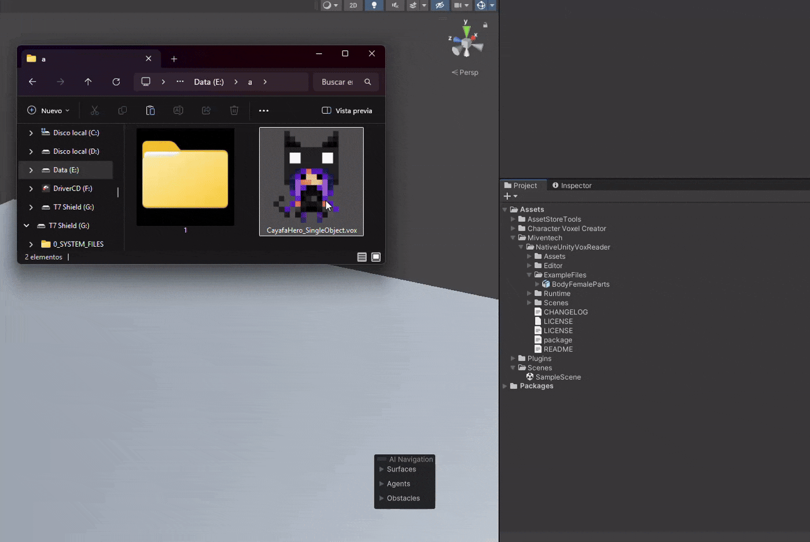

# Native Vox Reader

[Español](README_ES.md)

**The most natural and powerful way to bring MagicaVoxel art into Unity.**

Native Unity VOX Reader is a high-performance library and asset importer that allows you to treat MagicaVoxel `.vox` files as native Unity assets. No complex setup—just drag, drop, and enjoy.

---

##  Demos

### Instant Import
Drag any `.vox` file into your Unity Project window, and it's ready to go. It automatically generates optimized meshes and materials.

### Real-time Workflow
Keep MagicaVoxel open, save your changes, and watch Unity update your models instantly. It breathes life into your creative process.

---

##  Key Features

*   **📦 Plug & Play**: Drag `.vox` or `.vengi` files directly into your scene. Unity treats them like prefabs.
*   **🌳 Scene Awareness**: Fully supports MagicaVoxel hierarchies (Groups and Transformations).
*   **📐 High Optimization**: Advanced **Greedy Meshing** reduces poly count by up to 90% compared to cube-based methods.
*   **🎨 Texture Baking**: Bakes all voxel colors into a single atlas to keep your draw calls at a minimum.
*   **🛠 Inspector Controls**: Adjust scale, atlas size, and mesh density directly on the asset importer.
*   **🧩 Minimalist & Clean**: Zero external dependencies and includes Assembly Definitions for optimal compile times.
*   **🔄 Vengi Support**: Now includes support for reading and importing data from Vengi.

---

## 🚀 Upcoming Features (Roadmap)

*   **🎬 Animation System**: We are currently developing a native voxel animation system to bring your characters to life directly within the tool.
*   **⚡ Further Optimization**: Continued performance improvements for large scale scenes.
*   **🛠 Advanced Editing Tools**: More integrated tools for voxel manipulation within the Unity Editor.

---

##  Getting Started

1.  **Installation**:
    - **Option A (Package Manager - Recommended)**: 
        1. In Unity, go to `Window` > `Package Manager`.
        2. Click the `+` button and select `Add package from git URL...`.
        3. Paste: `https://github.com/miventech/NativeUnityVoxReader.git`
    - **Option B (Manual)**: Copy the `NativeUnityVoxReader` folder into your `Assets` directory.
2.  **Usage**: 
    - **Automatic**: Just drag a `.vox` file into your Project.
    - **Runtime**: Use the `VoxReader` component or `ReaderVoxFile.Read()` via script.
3.  **Settings**: Click on any `.vox` asset in Unity to adjust its import settings in the Inspector.

---

## 🛠 Project Structure

*   **/Runtime**: Core logic for binary parsing and mesh building.
*   **/Editor**: The `ScriptedImporter` that powers the automatic asset conversion.
*   **/ExampleFiles**: Sample models to get you started.

---

## 📜 Support the Project

This project is open-source and **completely free**. I created it to help the community create amazing things with voxels in Unity.

If this tool made your life easier, consider buying me a coffee. Your support helps me maintain the library and keep creating tools for everyone!

[**☕ Buy Me a Coffee**](https://buymeacoffee.com/miventech0)

---
*Created with passion by Miventech.*

